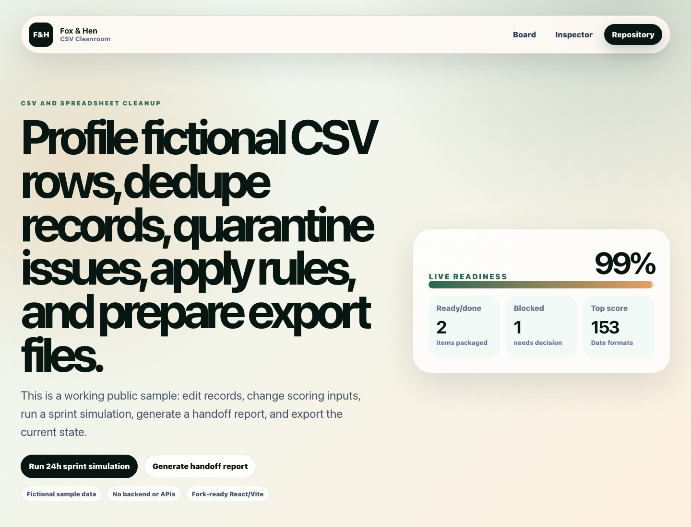

# CSV Cleanroom

Local CSV cleanup utility from **Fox & Hen**. Paste or drag in a CSV, choose a profile, review issues, and export cleaned rows plus an issue report.



## Live Demo

- Demo: [https://freetoolsforpeople.com/csv-cleanroom](https://freetoolsforpeople.com/csv-cleanroom)
- Repository: [https://github.com/foxandhenllc/foxhen-csv-cleanroom](https://github.com/foxandhenllc/foxhen-csv-cleanroom)
- License: [MIT](LICENSE)

## What It Does

- Accepts CSV by drag/drop, file picker, or paste.
- Supports cleaning profiles for email lists, contact imports, and content inventories.
- Parses rows locally and validates email, URL, date, and US phone fields.
- Detects duplicate keys, missing required columns, missing required values, whitespace, and casing issues.
- Shows a sortable-style issue table and cleaned-data preview in the browser.
- Exports cleaned CSV, JSON issue report, and Markdown handoff.
- Includes a local Node CLI for repeatable fixture/client handoffs.

## Screenshots

The screenshot above shows the browser app with fictional rows, issue counts, validation findings, and export controls. Refresh `docs/demo-screenshot.png` after meaningful UI changes.

## Use Cases

- Newsletter or email-list import cleanup.
- CRM contact dedupe before migration.
- Content inventory URL/date normalization.
- Public-safe proof of a spreadsheet QA workflow.

## CLI Usage

```bash
node bin/csv-cleanroom.mjs fixtures/dirty-email-list.csv \
  --profile email-list \
  --out cleaned.csv \
  --report report.json \
  --markdown handoff.md
```

Available profiles:

- `email-list`
- `contact-import`
- `content-inventory`

## Local Development

```bash
npm install
npm run dev
npm run smoke
npm run typecheck
npm run build
```

`npm run smoke` runs the CLI against `fixtures/dirty-email-list.csv` and verifies cleaned CSV plus JSON report output.

A copy-ready CI workflow lives at `docs/github-actions/build.yml.example`; move it to `.github/workflows/build.yml` after GitHub auth has the `workflow` scope.

## Client Customization

- Update browser fixture/use-case copy in `src/data/sampleCsv.ts`.
- Add or change profiles in `src/lib/csvCleanroom.js` so UI and CLI stay in sync.
- Adjust browser downloads in `src/exporters/downloads.ts`.
- Use `docs/client-brief-template.md` before adapting the tool for a buyer.
- Follow `docs/public-safe-data.md` before committing screenshots, fixtures, or reports.

See `docs/customization-guide.md` for profile and export customization details.

## Public-Safe Scope

CSV Cleanroom is a static React + TypeScript + Vite app with a local Node CLI. It has no backend, auth, tracking, upload endpoint, secrets, or real data. All committed fixtures and screenshots must remain fictional.
## SEO / AIO Discoverability

**Plain-language answer:** Use this repo to clean and validate CSVs locally with profiles, duplicate detection, issue reports, cleaned exports, and a Node CLI.

**Who it helps:** operators, marketers, and developers cleaning CSVs before imports or handoffs.

**Search intents covered:**

- CSV cleanup tool
- browser CSV validator
- local CSV cleaner CLI
- email list import cleaner

**Why this repo is useful:** It keeps data cleanup transparent and auditable without uploading private files to a backend.
